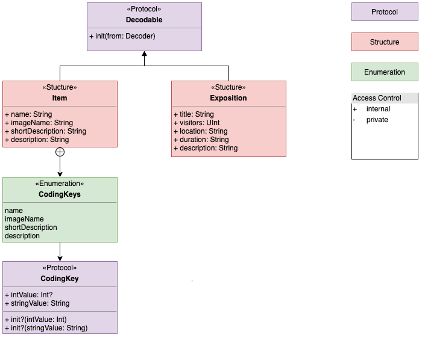

# 만국박람회 프로젝트 2021.07.05. ~ 2021.07.16.
## 수박, 잼킹, 조이, 타일러 (타일러와 아이들)

---

### Ⅰ. What have we done?

| 1주차 공부 주제 | 내용 |
| --- | --- |
| Decodable을 활용한 JSONDecodable 정의 | * Codable   * CodingKey 
| NSAssetData 분석 | - |
| asset 파일 분석 및 이에 대한 JSONModel 정의 | Exposition.swift, Item.swift |
| 위 3개 항목에 대한 Unit test | * Expo1900Tests.swift   * SOLID를 준수하는 test에 대한 고민...   * 에러를 어디까지 전파할 것이며, 어떻게 처리할 것인지에 대한 고민... |
| 메인 화면 구현 | * AttributedText   * NSMutableAttributedString |
| UINavigationController 분석 | - |
| UIScrollView 분석 | - |
| UITableView 분석 | * UITableViewDelegate   * UITableViewDataSource   * ReusableCell   * Cell customizing   * Delegation pattern |
| 뷰컨트롤러 간 데이터 전달 | Segue, Cofigure, Delegation, Closure... |
| 접근성 | * Voice over   * Dynamic type |
| Protocol Oriented Programming(POP) | Protocol + Extension |
| UML |  |
 
| 2주차 공부 주제 | 내용 |
| --- | --- |
| 함수형 프로그래밍 | - |
| 고차함수 | 함수를 반환하거나 인자로 받는 함수 |
| LLDB | 디버깅 툴인데... 많이 어렵고 복잡하다 아직 공부 중 |
| Unit test | *Code coverage   *setUp(), tearDown() |
| AutoLayout | Constraints |

---

### Ⅱ. The problems we faced

| Promblem | Solution |
|---|---|
| 상수 관리 | * 사용하는 클래스 안에서 프로퍼티로 두거나 enum 따위로 랩핑하여 사용할 것인지   * 아니면 따로 이것들을 전부 모아놓은 파일을 하나 만들어놓고 여기서 static let으로 정의를 할 것인지   * 등등... 많은 이야기가 오갔으나 앱 전역에서 사용해야 하는 내용과, 어떤 타입(특히 뷰나 모델)에 종속되는 내용의 경우에는 해당 타입에 nested enum을 활용하여 사용하기로 했다   * 특히 enum static let을 사용하여, init이 불가하게 사용하기로 합의를 했다 |
| 에러 핸들링 | * 어디까지 전파할 것인지, 어떻게 전파할 것인지로 많은 이야기를 나누었다   * 어디까지 전파할 것인지는, 모델의 에러는 모델 안에서 끝난 뒤로    * 어떻게는 기본값으로 설정된 객체나 아예 nil을 반환하는 게 좋을 것 같다고 이야기가 정리되었다 | 
| extension의 위치 | * 해당 타입을 사용하는 곳에서 extension으로 확장하여 사용하려고 했으나   * 따로 extension에 대한 파일을 만드는 게 보기 좋을 것 같다고 이야기를 들었다 |
| SOLID를 준수하기 | 어떤 객체의 성질과 기능을 잘 파악하고 나누려는 시도...를 했지만 완벽하진 않은 것 같다. 특히 모델의 경우 데이터가 가공(formatting)될 필요가 있었는데 이에 대한 처리를 어디서 하는 게 좋을지... 누가 하는 게 좋을지... 등등 오래 고민을 했으나 정답이 없어서 적당한 선에서 그만두고 마무리를 했다 |
| 접근성 | * 많은 삽질을 했으나 좋은 이야기를 들으며 마무리를 지었다 |
